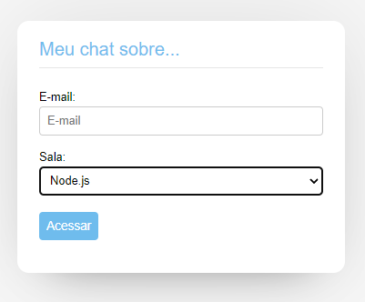

# Semana Imersão Node.js, React e React Native - Celke 

Participei da semana de imersão com as tecnologias Node.js no Backend, React no Frontend na Web e no mobile, foi apresentado o React Native. 

Links para encontrar o Celke.

Instagram (celkecursos): https://www.instagram.com/celkecursos/
Facebook: https://www.facebook.com/celkecursos/
Twitter (@celkecursos): https://twitter.com/celkecursos
E-mail de contato: atendimento@celke.com.br
Linkedin: https://www.linkedin.com/company/celke/

# Projeto

</img> 
</img> 
